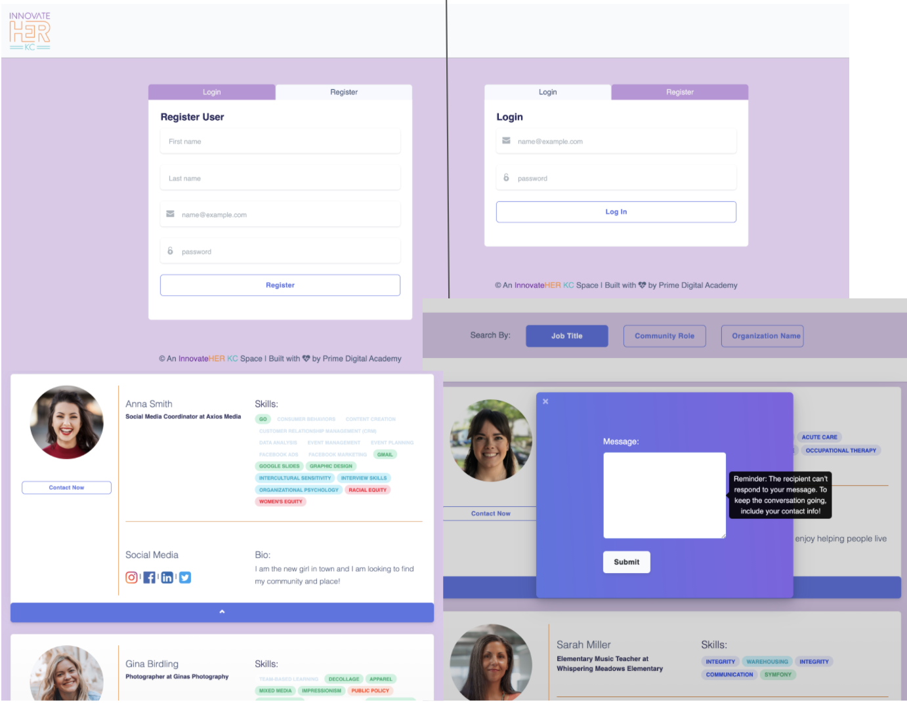
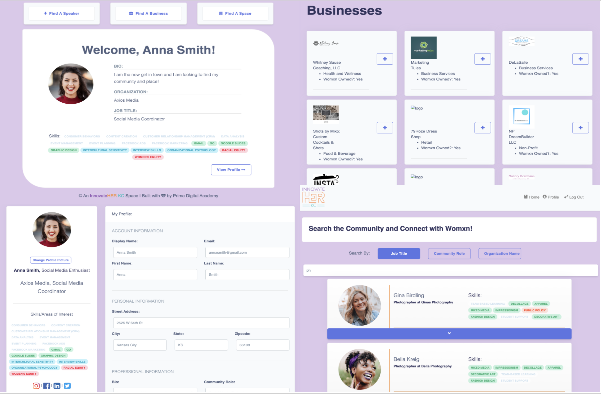
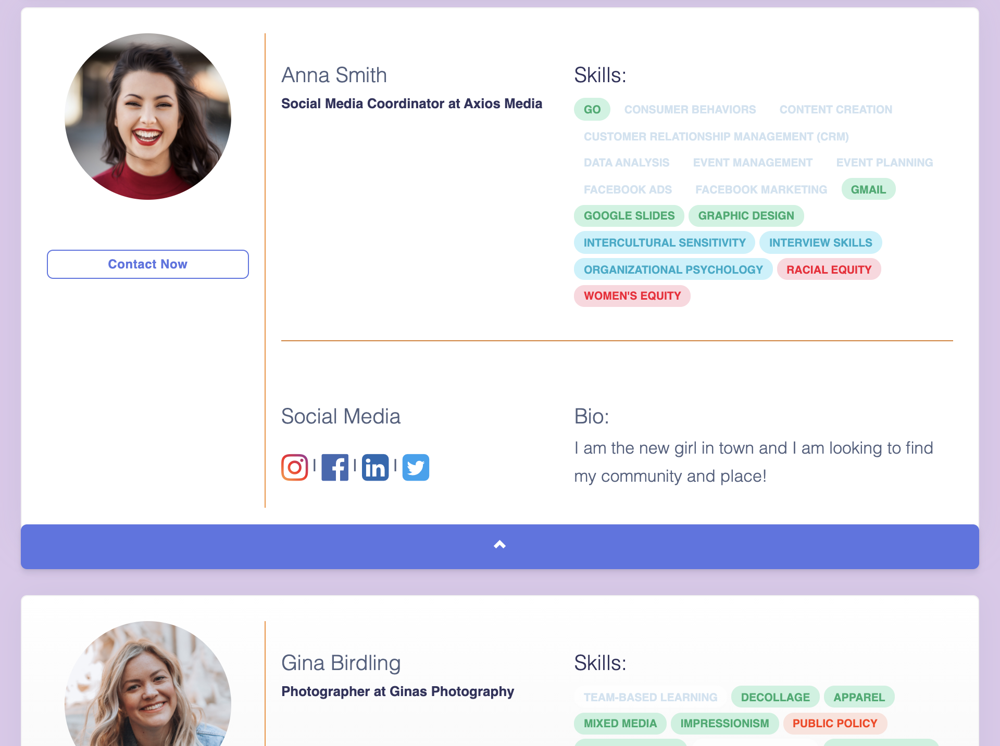

# ConnectHER

## Description

_Duration: 3 Week Sprint_

InnovateHER KC, a nonprofit in Kansas City, MO committed to supporting all womxn, promoting diversity, and advancing its member’s professional goals—came to Prime Digital Academy with a challenge.

Their online presence began on Facebook and has grown to 3,000+ members. As the community has grown, so have its needs. For example, while the group was smaller and the FB Page had less activity, sifting through previous posts for like-minded people and resources wasn’t as inconvenient as it is now. Today, the page is so active that finding a post from an hour ago is a challenge.

In summary, the ask was to conveniently organize InnovateHER’s resources for member’s easy access and provide a more targeted way of connecting with similar and/or complementary individuals.

Out of this request, ConnectHER, a social networking application tailored to InnovateHER, emerged. It promotes inclusive interaction while also aligning specific members based on similarities, gathers analytics in a straightforward manner allowing newfound knowledge to better the user experience, and ultimately, makes community resources more easily accessible.

To see the fully functional site, please visit: [coming soon](www.heroku.com)

## Screen Shots

### Prerequisites

Link to software that is required to install the app (e.g. node).

- [Node.js](https://nodejs.org/en/)
- [Docker](https://www.docker.com/)

## Installation

This version of the project uses Docker to run the development environment. If you haven’t installed [docker](https://www.docker.com/), do so now.

Clone this repo to your local machine.
Open the project in the editor of your choice, we use [VS Code](https://code.visualstudio.com/) and run `npm install`.
In order to access specific functions and API’s you will need to configure a `.env` file. Please see detailed instructions below.\*
From the project root directory: `docker-compose up --build`
The development database should populate with the data stored in the `init.sql` and `data.sql` files.\*\*
Once the development server has started it should serve a message to indicate the server started successfully.
In a browser, go to `http://localhost:3000`. You should see the application running.
There are user profiles created in the `data.sql` so you may login as one of them or create your own.

\*Detailed Instructions for Configuring the .env (Secure Development)

Database name as `DATABASE_NAME`.
Server session secret: `SERVER_SESSION_SECRET` and this can be equal to a secure password. For help creating a password: [Password Generator](https://passwordsgenerator.net/).
The Docker database setup is handled in 3 configs: `DOCKER_DB_PORT=5432` (defaulted config), `DOCKER_DB_USER` (set to your configuration for secure dev), and `DOCKER_DB_PASS`.
A `NODE_ENV` can be set to ‘development’.
Airtables API can be accessed at [Airtable](https://airtable.com/). The API Key will be configured as `AIRTABLE_API_KEY` and will also require the BASE key as `BASE`.
For AWS S3, configure the `.env` with your account and API Access Key: `AWS_ACCESS_KEY_ID` and your Secret Key as `AWS_SECRET_ACCESS_KEY`.
Email masking functionality is handled by Nodemailer. This sends secure emails from an account to keep users hidden until choosing to share their contact information. This can be configured in the `.env` file with `NODEMAILER_USERNAME` and `NODEMAILER_PASSWORD`.

\*\*The project is built on [Postgres](https://www.postgresql.org/download/), so you will need to make sure to have that installed. We recommend using Postico to run those queries as that was used to create the queries.

## Usage

Steps:

Note: For testing purposes, test accounts and data are currently initialized with the project upon build. These lines can be removed and are not entirely necessary, but may prove helpful as a tool to show off the application

1. Register and/or login to the application. If you’re creating a new account, you’re directed to the ‘Step 1 - About Me’ tab. Complete the forms on tabs 1-3 by providing the necessary information, and click ‘Submit.’

2. After logging into your account, you see the Landing Page. Note, you can also reach this page by selecting ‘Home’ in the top nav bar.

The Landing Page contains a brief summary of your own information and an option to ‘View Profile.’ You can also view and edit your profile information by selecting ‘Profile’ in the top nav bar.

Additionally, the page contains one large button at the very top labeled ‘IHKC Community,’ and below, you see three smaller buttons labeled as follows: “‘Find a Business,’ ‘Find a Speaker,’ ‘Find a Space.’”

3. To search through the community of members, select the ‘IHKC Community’ button. After navigating to the Search Page, you can find members by inputting a job title, community role, or an organization name. When the search results appear, clicking the down carrot shows more information about a user and let’s you contact them from within the app.

4. Selecting one of the three smaller buttons from the Landing Page, you can view a list of local businesses, speakers, and/or spaces to hold events. Selecting the ‘+’ button expands a card, and you can view additional information including contact info for the individual or entity. Note: these are resources, not necessarily members, so the option to contact them from within in the app is not available.

User Story:

The following snippet illustrates how a user will utilize and navigate through the ConnectHER application. (0:00 - 5:42).

(https://vimeo.com/460774354)

## Built With

React
React-redux
Redux-saga
Formik
Moment.js
Node.js
Express
Typescript
Nodemailer
Airtable API
Amazon S3 API
PostgreSQL
Docker
Heroku

## Acknowledgement

Thanks to [Prime Digital Academy](www.primeacademy.io) who equipped and helped us to make this application a reality.
A special thank you to Lauren Conaway and the InnovateHER KC team for giving us this opportunity.
Thank you to the ConnectHER team for all the hard-work and support
